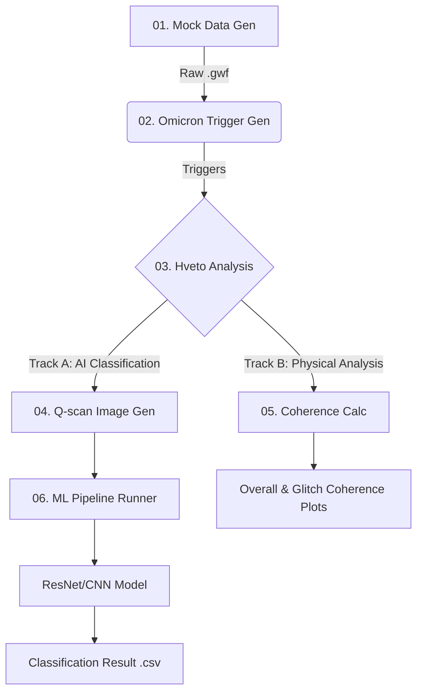

# End-to-End MLOps Pipeline for Time-Series Anomaly Detection
**(Automated Pipeline for Detection and Classification of Time-Series Anomalies)**


## Project Overview

This project is an automated pipeline designed to detect and identify the root causes of abnormal signals (Anomalies/Glitches) in large-scale time-series data (KAGRA Gravitational Wave Data).

By using a **Mock Data Generator**, it creates virtual data that reflects physical characteristics and reproduces the entire analysis process in a local environment: **Omicron (Triggering) → Hveto (Correlation) → Deep Learning (Classification)**. The architecture is flexible, branching into two independent paths depending on the analysis goal: **AI-based Classification (Deep Learning)** and **Linear Coupling Analysis (Coherence)**.

It has been redesigned as a portable architecture for portfolio use, removing dependencies on sensitive research data and large-scale clusters (HTCondor) while maintaining the integrity of the original scientific logic.

> **Key Point:** This repository is also compatible with large-scale parallel processing in the KISTI Supercomputing environment.

---

## System Architecture

The system consists of a Common Phase (Data Generation & Pre-processing) and two specialized analysis tracks.



### Common Modules (Pre-processing)
#### 1. Mock Data & Trigger Generation (Data Ingestion)
* **Role:** Generates virtual gravitational wave/glitch data with controlled physical parameters (Frequency, Q-value, SNR) and detects high-energy events using the Omicron algorithm.
* **Tech:** Python, NumPy (Signal Injection), GWpy, Omicron (Wavelet Transform).
* **Process:**
    * 1. Phase-locking: Simulates physical causality by synchronizing phases between main and auxiliary channels.
    * 2. Noise Injection: Injects signals into Gaussian Noise to create mock .gwf files.
    * 3. Triggering: Detects events with SNR >= 6.0 from the generated data.
* **Scalability:** Supports large-scale data via automated File List (FFL) generation and batch processing. Uses 32-second chunking to enable long-term data generation (days/months) without memory overhead.
* **Output:** Raw Data (.gwf), Trigger List (.root or .xml).

#### 2. Statistical Correlation Analysis (Root Cause Analysis)
* **Role:** (Core Step) Performs primary validation of whether detected signals are statistically similar in the time-frequency domain and extracts a list of suspect Auxiliary Channels.
* **Tech:** Hierarchical Veto (Hveto), Data Mining, Runtime Monkey Patching.
* **Process:** Analyzes correlations with hundreds of auxiliary channels to summarize noise/glitch signals by channel, frequency, and time.
    * 1. Dynamic Patching: Dynamically modifies code at runtime to resolve compatibility issues with legacy libraries.
    * 2. Round-Robin Analysis: Identifies the root cause by sequentially removing (vetoing) the most correlated channels.
* **Output:** Vetoed Segments List, Winner Channel Info (log file, .png, .txt, .html).

### Track A: AI-Driven Classification (MLOps Path)
#### 3-A. Feature Engineering (Q-transform)
* **Role:** Converts signals identified in Hveto analysis into high-resolution time-frequency images suitable for deep learning.
* **Tech:** Q-transform (Time-Frequency Analysis), Multiprocessing.
* **Process:** Crops windows based on Trigger Time (GPS) and visualizes frequency energy to extract morphological features of glitches.
* **Scalability:** Utilizes Python Multiprocessing to parallelize the imaging of thousands of triggers.
* **Output:** Normalized Q-spectrogram Images (.png).

#### 4-A. Deep Learning Classification
* **Role:** Feeds generated images into CNN models to classify glitch types and calculate confidence scores.
* **Tech:** PyTorch & TensorFlow (Hybrid Support), ResNet/CNN.
* **Process:**
    * 1. Training: Supervised learning using data/training_set.
    * 2. Inference: Batch inference on new Q-scan images.
* **Feature:** Automated training/inference pipelines with multi-framework support.
* **Output:** Prediction CSV (Class & Probability), Accuracy/Loss Graphs, Results Folder.

### Track B: Physical Coherence Analysis (Physics Path)
#### 3-B. Deep Learning Classification (Model Serving)
* **Role:** Quantitatively verifies linear coupling between signals beyond simple statistical correlation.
* **Tech:** FFT (Fast Fourier Transform), Welch's Method, SNR-weighted Averaging.
* **Process:** Identifies quantitative causality by comparing long-term period averages with glitch-moment averages in the frequency domain.
    * **Overall Coherence:** Checks the influence of stationary noise over long durations.
    * **Glitch Coherence:** Minimizes the "Dilution Effect" by applying SNR weights to the glitch moment (0.5s) to prove actual causality.
* **Output:** Overall and Glitch Coherence Graphs (.png) visualizing coupling across frequency bands.
* **(Optional)** Targeted Q-scan: Conducted when specific channels show low coherence in both types but require further visual morphological analysis.

---

## Tech Stack & Skills

| Category | Technologies |
| :--- | :--- |
| **Language** | Python 3.8+ |
| **Data Processing** | NumPy, Pandas, SciPy, **GWpy**, **Omicron**, **Hveto** (Time-series analysis), LALSuite |
| **Deep Learning** | **PyTorch**, **TensorFlow/Keras**(Multi-backend support) |
| **Orchestration** | **HTCondor** (Batch Job Scheduling), Shell Scripting |
| **Visualization** | Matplotlib, Seaborn |
| **Environment** | Conda, CVMFS (Cluster File System), **Micromamba** (Isolated Environments for IGWN & ML) |
| **Data Format** | **GWF (Gravitational Wave Frame)**, ROOT, XML |
---

## Key Engineering Competencies

### 1. Robust Environment Isolation
* Implemented a Dual Environment strategy using Micromamba to prevent dependency conflicts between scientific libraries (igwn) and deep learning libraries (ml).

### 2. Automated Pipeline Design
* Defined clear I/O for each stage to ensure Idempotency within the data pipeline.

### 3. Testing & Reproducibility (Mocking)
* Developed a Mock Data Generator to replace sensitive data and restricted server environments. Established a Smoke Test environment to verify the full ETL -> ML logic on local machines.

### 4. Multi-Framework Support
* Implemented modeling code for both PyTorch and TensorFlow to avoid framework lock-in, selectable at runtime via the --framework argument.

### 5. Legacy System Modernization & Runtime Patching
* Resolved severe version conflicts between legacy tools (Hveto) and modern libraries (Matplotlib 3.5+, GWpy). Applied Runtime Monkey Patching to replace functions dynamically, ensuring deployment integrity without altering original library source codes.
    * *Major Fixes:* Empty segment handling logic, Matplotlib API changes adaptation, ROOT file I/O compatibility.
---

## 📂 Directory Structure

```text
KAGRA-UNIST_Detchar_pipeline/
├── README.md                 # Project Documentation
├── setup/                    # Environment Setup Scripts
│   ├── install_igwn_env.py   # Setup for Physics/GW tools
│   └── install_ml_env.py     # Setup for PyTorch/TensorFlow
├── scripts/                  # Main Pipeline Executors (Ordered)
│   ├── 01_generate_mock.py   # Mock Data Generation
│   ├── 02_process_omicron.py # Trigger Generation
│   ├── 03_run_hveto.py       # Correlation Analysis (Patched)
│   ├── 04_generate_qscan.py  # Image Generation for ML
│   ├── 05_calc_coherence.py  # Physical Coherence Analysis
│   └── 06_run_ml_pipeline.py # ML Training & Inference
├── src/                      # Source Modules
│   └── ml/                   # ML Model Definitions & Trainers
├── data/                     # Data Storage
│   └── training_set/         # Labeled Images for Training
└── results/                  # Analysis Outputs (Ignored by Git)
    ├── {date}_mock/          # Daily Analysis Results
    │   ├── raw/              # Generated GWF Files
    │   ├── omicron/          # Trigger XMLs
    │   ├── hveto/            # Veto Results & Logs
    │   ├── qscans/           # Spectrogram Images
    │   ├── coherence/        # Coherence Plots
    │   └── machine_learning/ # Model & Prediction CSV
```
---

# How to Run (Step-by-Step)

## Phase 0: Environment Setup
### 1. GW Analysis Environment (igwn)
```bash
python setup/install_igwn_env.py
```
### 2. Machine Learning Environment (ml)
The script automatically detects system architecture (Intel/Apple Silicon) and installs optimized TensorFlow/Metal.
```bash
python setup/install_ml_env.py
```
> **Note for Apple Silicon (M1/M2/M3) Users:** The installation script automatically detects if it is running under a **Rosetta (x86)** environment. It forcibly configures an **ARM64 (Native)** based environment to enable **tensorflow-metal** acceleration. You can run the script as-is without changing any terminal settings.

## Phase 1: Data Generation & Pre-processing
Activate the physics environment:
```bash
source ./activate_igwn_env.sh
```

### Step 1: Mock GWF Data Generation (e.g., 2026-01-01)
```bash
python scripts/01_generate_mock.py -y 2026 -m 1 -d 1
```
#### (Optional) Customizing Data Duration: If you want to adjust the length of the generated data, add the `--duration [seconds]` option. The default duration is 14400 seconds (4 hours). For example, to generate data for an entire day (86400 seconds):
```bash
python scripts/01_generate_mock.py -y 2026 -m 1 -d 1 --duration 86400
```

### Step 2: Omicron Trigger Generation
```bash
python scripts/02_process_omicron.py -y 2026 -m 1 -d 1
```

### Step 3: Hveto Analysis (Root Cause Analysis)
```bash
python scripts/03_run_hveto.py -y 2026 -m 1 -d 1
```

## Phase 2: Analysis Tracks
### Track A: AI Classification (MLOps)

#### Step 4: Generate Q-scans (Still in igwn env)
```bash
python scripts/04_generate_qscan.py -y 2026 -m 1 -d 1
```

#### Step 6: Run ML Pipeline (Switch to ML env!)
```bash
source ./activate_ml_env.sh
```
The pipeline is designed to take the framework as an argument. You can choose your preferred framework or run both to compare their performance.
```bash
python scripts/06_run_ml_pipeline.py -y 2026 -m 1 -d 1 --framework pytorch
```
or
```bash
python scripts/06_run_ml_pipeline.py -y 2026 -m 1 -d 1 --framework tensorflow
```

### Track B: Physical Analysis
Switch back to igwn env and calculate coherence for specific ranks:
```bash
source ./activate_igwn_env.sh
```
#### Step 5: Coherence Calculation
Time-weighted average coherence
```bash
python scripts/05-a_calc_coherence_overall.py -y 2026 -m 1 -d 1 -r 1
```
SNR-weighted) average coherence
```bash
python scripts/05-b_calc_coherence_glitch.py -y 2026 -m 1 -d 1 -r 1
```

## Pipeline Execution Results (Preview)

The execution result of each step is saved in results/{date}_mock/. (In the example, 2026-01-01_mock)

| Output Type | Output Example | Description | 
|------|---|---|
| Raw | results/{date}_mock/raw/*.gwf | Mock Raw Data (Frame format) reflecting physical characteristics such as Phase and SNR. |
| Omicron | results/{date}_mock/omicron/*.root (or *.xml) | List of event triggers with Signal-to-Noise Ratio (SNR) >= 6.0 (LIGOLW XML/ROOT format). | 
| Hveto | results/{date}_mock/hveto/ | Information on Winner Auxiliary Channels highly correlated with the main channel and Vetoed Segments. | 
| Q-scan<br>(Track A) | results/{date}_mock/qscans/main/*.png | High-resolution time-frequency spectrogram images used as input for Deep Learning models. | 
| ML Output<br>(Track A) | results/{date}_mock/machine_learning/ | Glitch classification results (Class & Probability) and model training accuracy/loss graphs. |
| Coherence<br>(Track B) | results/{date}_mock/coherence/*.png | Comparative analysis graphs of Overall (long-term) vs. Glitch (short-term) coherence. | 

---

**Author:** Kihyun Jung<br>
**Contact:** khjung@unist.ac.kr or wjk9364@gmail.com<br>
**Institution:** UNIST (Ulsan National Institute of Science and Technology)

