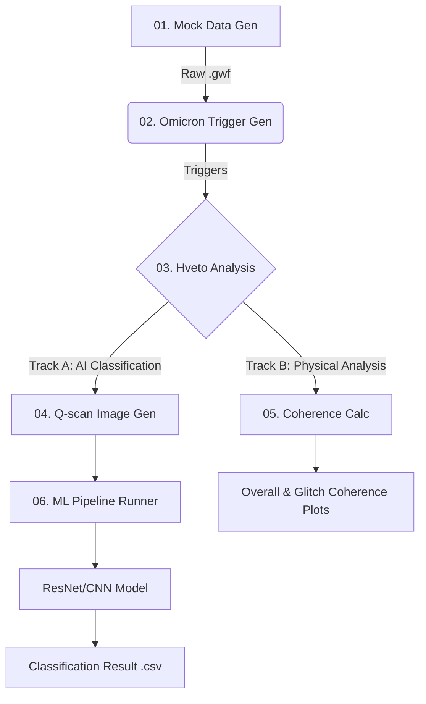

# End-to-End MLOps Pipeline for Time-Series Anomaly Detection
**(시계열 데이터 이상 탐지 및 분류를 위한 End-to-End MLOps 파이프라인)**


## Project Overview

본 프로젝트는 대규모 시계열 데이터(KAGRA Gravitational Wave Data)에서 발생하는 비정상 신호(Anomaly/Glitch)를 탐지하고 원인을 규명하는 자동화 파이프라인입니다.

Mock Data Generator를 통해 물리적 특성이 반영된 가상 데이터를 생성하고, Omicron(Triggering) → Hveto(Correlation) → Deep Learning(Classification)으로 이어지는 전체 분석 과정을 로컬 환경에서 재현할 수 있도록 구축되었습니다. 이후 분석 목적에 따라 AI 기반 분류(Deep Learning)와 선형 결합도 분석(Coherence)의 두 가지 독립적인 경로로 분기되는 유연한 아키텍처를 가집니다.

연구 데이터 보안 문제와 대규모 클러스터(HTCondor) 의존성을 탈피하여, 어디서든 실행 가능한 포트폴리오용 아키텍처로 재설계되었습니다.

> **Key Point:** 본 레포지토리는 KISTI 슈퍼컴퓨팅 환경의 대규모 병렬 처리로도 실행 가능합니다.

---

## System Architecture

전체 시스템은 데이터 생성 및 전처리(Common Phase)와 목적에 따라 나뉘는 두 개의 분석 트랙으로 구성됩니다.



### Common Modules (Pre-processing)
#### 1. Mock Data & Trigger Generation (Data Ingestion)
* **Role:** 물리적 특성(Frequency, Q-value, SNR)이 제어된 가상의 중력파/글리치 데이터를 생성하고, Omicron 알고리즘을 통해 에너지가 급증하는 구간(Event)을 탐지합니다.
* **Tech:** Python, NumPy (Signal Injection), GWpy, Omicron (Wavelet Transform).
* **Process:**
    * 1. Phase-locking: 메인 채널과 보조 채널 간의 위상을 동기화하여 물리적 인과관계를 모사.
    * 2. Noise Injection: Gaussian Noise에 신호를 주입하여 가상 데이터(Mock .gwf) 생성.
    * 3. Triggering: 생성된 데이터에서 SNR 6.0 이상의 이벤트를 검출.
* **Scalability:** 파일 리스트(FFL) 자동 생성 및 배치 처리를 통한 대용량 데이터 대응. 32초 단위 청크(Chunk) 생성 방식으로 메모리 오버헤드 없이 장기간(일/월 단위) 데이터 생성 가능.
* **Output:** Raw Data (.gwf), Trigger List (.root or .xml).

#### 2. Statistical Correlation Analysis (Root Cause Analysis)
* **Role:** (Core Step) 탐지된 신호가 시간-주파수 상에서 통계적으로 유사한 지 1차 검증하고, 의심되는 보조 채널(Auxiliary Channels) 리스트를 추출합니다. 이 결과는 이후 모든 분석의 기준이 됩니다.
* **Tech:** Hierarchical Veto (Hveto), Data Mining, Runtime Monkey Patching.
* **Process:** 수백 개의 보조 채널(Aux Channels)과의 상관관계를 분석하여 노이즈/글리치 신호를 관련 보조 채널, 주파수, 시간 정보를 총 정리합니다.
    * 1. Dynamic Patching: 레거시 라이브러리의 호환성 문제를 해결하기 위해 실행 시점에 코드를 동적으로 수정.
    * 2. Round-Robin Analysis: 가장 상관성이 높은 채널부터 순차적으로 제거(Veto)하며 원인을 규명.
* **Output:** Vetoed Segments List, Winner Channel Info (log file, .png, .txt, .html).

### Track A: AI-Driven Classification (MLOps Path)
#### 3-A. Feature Engineering (Q-transform)
* **Role:** Hveto 분석에서 걸러진(Vetoed) 신호를 딥러닝 모델이 학습할 수 있는 고해상도 시간-주파수 이미지로 변환합니다.
* **Tech:** Q-transform (Time-Frequency Analysis), Multiprocessing.
* **Process:** 트리거 시간(GPS)을 기준으로 윈도우를 자르고, 주파수 에너지를 시각화하여 글리치의 형태학적 특징(Morphology)을 추출.
* **Scalability:** Python Multiprocessing을 적용하여 수천 개의 트리거를 병렬로 이미지화.
* **Output:** Normalized Q-spectrogram Images (.png).

#### 4-A. Deep Learning Classification
* **Role:** 생성된 이미지를 CNN 모델에 주입하여 글리치의 유형(Class)을 분류하고 신뢰도(Confidence)를 산출합니다.
* **Tech:** PyTorch & TensorFlow (Hybrid Support), ResNet/CNN.
* **Process:**
    * 1. Training: data/training_set을 이용한 지도 학습(Supervised Learning).
    * 2. Inference: 새로운 Q-scan 이미지에 대한 배치 추론.
* **Feature:** 학습(Train)과 추론(Inference) 파이프라인의 자동화, 다중 프레임워크 지원.
* **Output:** Prediction CSV (Class & Probability), Accuracy/Loss Graphs, 분류 결과 폴더

### Track B: Physical Coherence Analysis (Physics Path)
#### 3-B. Deep Learning Classification (Model Serving)
* **Role:** 통계적 상관관계(Hveto)를 넘어, 신호 간의 선형 결합도(Linear Coupling)를 정량적으로 검증합니다.
* **Tech:** FFT (Fast Fourier Transform), Welch's Method, SNR-weighted Averaging.
* **Process:** 단순 시간 일치를 넘어 주파수 영역(Frequency Domain)에서의 전체적인 기간 평균과 글리치 순간의 평균 정량적 인과관계를 규명합니다.
    * **Overall Coherence:** 장시간 평균을 계산하여 상시 잡음(Stationary Noise)의 영향을 확인.
    * **Glitch Coherence:** 글리치 발생 순간(0.5s)에 SNR 가중치를 두어 희석 효과(Dilution Effect)를 최소화하고 실제 인과관계를 증명.
* **Output:** 주파수 대역별 결합도를 시각화한 Overall, Glitch Coherence Graph(.png).
* **(Optional)** Targeted Q-scan: Overall, Glitch Coherence가 모두 낮게 나타난 특정 채널에 대해 추가적인 시각화 분석이 필요한 경우 Q-spectrogram 분석이 필요합니다.

---

## Tech Stack & Skills

| Category | Technologies |
| :--- | :--- |
| **Language** | Python 3.8+ |
| **Data Processing** | NumPy, Pandas, SciPy, **GWpy**, **Omicron**, **Hveto** (Time-series analysis), LALSuite |
| **Deep Learning** | **PyTorch**, **TensorFlow/Keras**(Multi-backend support) |
| **Orchestration** | **HTCondor** (Batch Job Scheduling), Shell Scripting |
| **Visualization** | Matplotlib, Seaborn |
| **Environment** | Conda, CVMFS (Cluster File System), **Micromamba** (Isolated Environments for IGWN & ML) |
| **Data Format** | **GWF (Gravitational Wave Frame)**, ROOT, XML |
---

## Key Engineering Competencies

### 1. Robust Environment Isolation
* 과학 계산용 라이브러리(igwn)와 딥러닝 라이브러리(ml) 간의 의존성 충돌을 방지하기 위해 Micromamba 기반의 이중 환경(Dual Environment) 전략을 사용했습니다.
* setup/ 스크립트를 통해 OS(Linux/Mac) 및 칩셋(Intel/Apple Silicon)을 감지하여 최적화된 환경을 자동 구축합니다.

### 2. Automated Pipeline Design
* 각 단계의 입출력(I/O)이 명확히 정의되어 있어, 데이터 파이프라인의 **멱등성(Idempotency)** 보장.

### 3. Testing & Reproducibility (Mocking)
* 보안상 공개 불가능한 민감 데이터와 서버 환경을 대체하기 위해 **Mock Data Generator** 개발.
* 외부 의존성 없이 로컬 머신에서도 전체 로직(ETL -> ML)을 검증할 수 있는 **Smoke Test** 환경 구축.

### 4. Multi-Framework Support
* 단일 프레임워크 종속성을 탈피하기 위해 **PyTorch**와 **TensorFlow** 두 가지 버전의 모델링 코드를 모두 구현 및 모듈화.
* `--framework` 인자를 통해 실행 시점에 런타임 결정 가능.

### 5. Legacy System Modernization & Runtime Patching
* 레거시 분석 도구(Hveto)와 최신 과학 연산 라이브러리(Matplotlib 3.5+, GWpy, Uproot 5) 간의 심각한 버전 호환성 문제(Dependency Conflict)를 해결.
* 라이브러리 소스 코드를 직접 수정하는 대신, 실행 시점에 동적으로 함수를 교체하는 **Runtime Monkey Patching** 기법을 적용하여 배포 무결성과 이식성(Portability)을 보장.
    * *Major Fixes:* Empty segment handling logic, Matplotlib API changes adaptation, ROOT file I/O compatibility.
---

## 📂 Directory Structure

```text
KAGRA-UNIST_Detchar_pipeline/
├── README.md                 # Project Documentation
├── setup/                    # Environment Setup Scripts
│   ├── install_igwn_env.py   # Setup for Physics/GW tools
│   └── install_ml_env.py     # Setup for PyTorch/TensorFlow
├── scripts/                  # Main Pipeline Executors (Ordered)
│   ├── 01_generate_mock.py   # Mock Data Generation
│   ├── 02_process_omicron.py # Trigger Generation
│   ├── 03_run_hveto.py       # Correlation Analysis (Patched)
│   ├── 04_generate_qscan.py  # Image Generation for ML
│   ├── 05_calc_coherence.py  # Physical Coherence Analysis
│   └── 06_run_ml_pipeline.py # ML Training & Inference
├── src/                      # Source Modules
│   └── ml/                   # ML Model Definitions & Trainers
├── data/                     # Data Storage
│   └── training_set/         # Labeled Images for Training
└── results/                  # Analysis Outputs (Ignored by Git)
    ├── {date}_mock/          # Daily Analysis Results
    │   ├── raw/              # Generated GWF Files
    │   ├── omicron/          # Trigger XMLs
    │   ├── hveto/            # Veto Results & Logs
    │   ├── qscans/           # Spectrogram Images
    │   ├── coherence/        # Coherence Plots
    │   └── machine_learning/ # Model & Prediction CSV
```
---

# How to Run (Step-by-Step)

이 프로젝트는 로컬 머신(Mac/Linux)에서 즉시 실행 가능합니다.

## Phase 0: Environment Setup
### 1. GW Analysis Environment (igwn)
```bash
python setup/install_igwn_env.py
```
### 2. Machine Learning Environment (ml)
이 파이프라인은 macOS (Intel 및 Apple Silicon) 와 Linux 환경을 모두 지원합니다. 포함된 설치 스크립트(install_ml_env.py)는 현재 시스템의 아키텍처를 자동으로 감지하여, 각 환경에 최적화된 TensorFlow 및 라이브러리를 설치합니다.
```bash
python setup/install_ml_env.py
```
> **Apple Silicon (M1/M2/M3) 사용자 참고:** 설치 스크립트는 **Rosetta(x86)** 환경에서 실행되더라도 이를 자동으로 감지합니다. 강제로 **ARM64 (Native)** 기반 환경을 구성하여 tensorflow-metal 가속 기능을 활성화하므로, 터미널 설정 변경 없이 그대로 실행하시면 됩니다.

## Phase 1: Data Generation & Pre-processing
물리 분석 환경(igwn)을 활성화한 후 실행합니다.
```bash
source ./activate_igwn_env.sh
```

### Step 1: Mock GWF Data Generation (e.g., 2026-01-01)
```bash
python scripts/01_generate_mock.py -y 2026 -m 1 -d 1
```
#### (Optional) 만약 생성하고 싶은 데이터의 길이를 조절하고 싶다면 --duration [seconds] 옵션을 추가하세요. 기본 생성은 14400 (4시간) 입니다. 예를 들어, 하루짜리 데이터를 생성하고 싶다면,
```bash
python scripts/01_generate_mock.py -y 2026 -m 1 -d 1 --duration 86400
```

### Step 2: Omicron Trigger Generation
```bash
python scripts/02_process_omicron.py -y 2026 -m 1 -d 1
```

### Step 3: Hveto Analysis (Root Cause Analysis)
```bash
python scripts/03_run_hveto.py -y 2026 -m 1 -d 1
```

## Phase 2: Analysis Tracks
### Track A: AI Classification (MLOps)
Q-scan 이미지를 생성하고 딥러닝 모델로 분류합니다.

#### Step 4: Generate Q-scans (Still in igwn env)
```bash
python scripts/04_generate_qscan.py -y 2026 -m 1 -d 1
```

#### Step 6: Run ML Pipeline (Switch to ML env!)
반드시 머신러닝 환경을 활성화하여야 합니다.
```bash
source ./activate_ml_env.sh
```
프레임워크를 인자로 두어 실행하도록 하였습니다. 원하는 것을 선택하여 할 수도, 두가지 모두를 돌려 비교를 해 볼 수 있습니다.
```bash
python scripts/06_run_ml_pipeline.py -y 2026 -m 1 -d 1 --framework pytorch
```
or
```bash
python scripts/06_run_ml_pipeline.py -y 2026 -m 1 -d 1 --framework tensorflow
```

### Track B: Physical Analysis
보조 채널과의 상관관계를 정밀 분석합니다. (다시 igwn 환경) 이때, -r 인자에는 hveto 결과로 나온 round winner 채널의 rank를 입력합니다. Round winner의 rank가 높을수록 유의도(Significance)가 높은 채널입니다.
```bash
source ./activate_igwn_env.sh
```
#### Step 5: Coherence Calculation
시간 가중 (Time-weighted) 평균 코히어런스 계산
```bash
python scripts/05_a_calc_coherence_overall.py -y 2026 -m 1 -d 1 -r 1
```
SNR 가중 (SNR-weighted) 평균 코히어런스 계산
```bash
python scripts/05_b_calc_coherence_glitch.py -y 2026 -m 1 -d 1 -r 1
```

## Pipeline Execution Results (Preview)

각 단계별 실행 결과는 results/{date}_mock/ 에 저장됩니다. (예시의 경우 2026-01-01_mock)

| Output Type | Output Example | Description | 
|------|---|---|
| Raw | results/{date}_mock/raw/*.gwf | 물리적 특성(Phase/SNR)이 반영된 Mock Raw Data (Frame format) |
| Omicron | results/{date}_mock/omicron/*.root (or *.xml) | 신호 대 잡음비(SNR) 6.0 이상인 이벤트 트리거 리스트 (LIGOLW XML) | 
| Hveto | results/{date}_mock/hveto/ | 메인 채널과 상관관계가 높은 보조 채널(Winner) 및 Vetoed Segments 정보 | 
| Q-scan<br>(Track A) | results/{date}_mock/qscans/main/*.png | 딥러닝 모델 입력을 위한 고해상도 시간-주파수 스펙트로그램 이미지 | 
| ML Output<br>(Track A) | results/{date}_mock/machine_learning/ | 글리치 분류 예측 결과(Class & Probability) 및 학습 정확도 그래프 |
| Coherence<br>(Track B) | results/{date}_mock/coherence/*.png | Overall(장구간) 대비 Glitch(단구간) 코히어런스 비교 분석 그래프 | 

---

**Author:** Kihyun Jung
**Contact:** khjung@unist.ac.kr or wjk9364@gmail.com
**Institution:** UNIST (Ulsan National Institute of Science and Technology)

