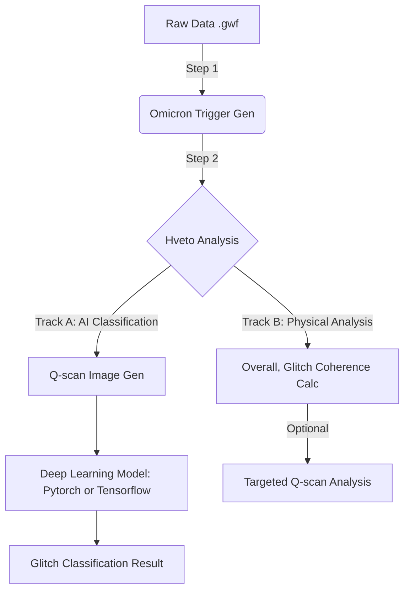

# End-to-End MLOps Pipeline for Time-Series Anomaly Detection
**(시계열 데이터 이상 탐지 및 분류를 위한 End-to-End MLOps 파이프라인)**


## Project Overview

본 프로젝트는 대규모 시계열 데이터(KAGRA Gravitational Wave Data)에서 발생하는 비정상 신호(Anomaly/Glitch)를 탐지하고 원인을 규명하는 자동화 파이프라인입니다.

Raw Data 수집부터 통계적 상관관계 분석(Hveto)까지를 공통 전처리 과정으로 수행하며, 이후 분석 목적에 따라 **AI 기반 분류(Deep Learning)**와 **선형 결합도 분석(Coherence)**의 두 가지 독립적인 경로로 분기되는 유연한 아키텍처를 가집니다.

> **Key Point:** 본 레포지토리는 KISTI 슈퍼컴퓨팅 환경의 대규모 병렬 처리를 로컬 환경에서도 검증할 수 있도록 **Mock Data Generator**와 **Simulation Logic**을 포함하여 포트폴리오용으로 재구성되었습니다.

---

## System Architecture

전체 시스템은 **공통 처리 모듈(Common Module)**과 목적에 따라 나뉘는 **두 개의 분석 트랙(Dual Analysis Tracks)**으로 구성됩니다.


```mermaid
graph TD
    A[Raw Data .gwf] -->|Step 1| B(Omicron Trigger Gen)
    B -->|Step 2| C{Hveto Analysis}
    
    C -->|Track A: AI Classification| D[Q-scan Image Gen]
    D --> E[Deep Learning Model: Pytorch or Tensorflow]
    E --> F[Glitch Classification Result]
    
    C -->|Track B: Physical Analysis| G[Overall, Glitch Coherence Calc]
    G -->|Optional| H[Targeted Q-scan Analysis]
```
### Common Modules (Pre-processing)
#### 1. ETL & Trigger Generation (Data Ingestion)
* **Role:** 대용량 Raw Binary Data(.gwf)를 로드하여 신호 대 잡음비(SNR)가 높은 신호(Event)를 필터링(Triggering)합니다.
* **Tech:** Python, GwPy, Dynamic Configuration.
* **Scalability:** 파일 리스트(FFL) 자동 생성 및 배치 처리를 통한 대용량 데이터 대응.
* **Output:** 트리거화된 중력파 데이터 파일 (.xml)

#### 2. Statistical Correlation Analysis (Root Cause Analysis)
* **Role:** (Core Step) 탐지된 신호가 시간-주파수 상에서 통계적으로 유사한 지 1차 검증하고, 의심되는 보조 채널(Auxiliary Channels) 리스트를 추출합니다. 이 결과는 이후 모든 분석의 기준이 됩니다.
* **Tech:** Hierarchical Veto (Hveto), Data Mining.
* **Process:** 수백 개의 보조 채널(Aux Channels)과의 상관관계를 분석하여 노이즈/글리치 신호를 관련 보조 채널, 주파수, 시간 정보를 총 정리합니다.
* **Output:** Hveto 결과를 요약한 .html 파일

### Track A: AI-Driven Classification (MLOps Path)
#### 3-A. Feature Engineering (Q-transform)
* **Role:** Hveto에서 걸러진 (거부된;veto) 신호를 고해상도 시간-주파수 이미지(Q-spectrogram)로 변환합니다.
* **Tech:** Q-transform (Time-Frequency Analysis)
* **Output:** 고해상도 Q-spectrogram 이미지.

#### 4-A. Deep Learning Classification
* **Role:** 생성된 이미지를 CNN 모델에 주입하여 글리치의 유형(Class)을 분류합니다.
* **Tech:** PyTorch & TensorFlow (Hybrid Support), CNN.
* **Feature:** 학습(Train)과 추론(Inference) 파이프라인의 자동화, 다중 프레임워크 지원.
* **Output:** 각 이미지별 예측 클래스와 확률(Confidence)이 기록된 결과 파일(.csv) 및 Accuracy, Validation graphs.

### Track B: Physical Coherence Analysis (Physics Path)
#### 3-B. Deep Learning Classification (Model Serving)
* **Role:** Hveto에서 지목된 보조 채널과 메인 채널(Strain) 간의 **주파수 대역별 결합도(Coupling)**를 정량적으로 계산합니다.
* **Tech:** FFT, Spectral Coherence Calculation.
* **Process:** 단순 시간 일치를 넘어 주파수 영역(Frequency Domain)에서의 전체적인 기간 평균과 글리치 순간의 평균 정량적 인과관계를 규명합니다.
* **Output:** 주파수 대역별 결합도를 시각화한 Overall, Glitch Coherence Graph(.png).
* **(Optional)** Targeted Q-scan: Overall, Glitch Coherence가 모두 낮게 나타난 특정 채널에 대해 추가적인 시각화 분석이 필요한 경우 Q-spectrogram 분석이 필요합니다.

---

## Tech Stack & Skills

| Category | Technologies |
| :--- | :--- |
| **Language** | Python 3.8+ |
| **Data Processing** | NumPy, Pandas, SciPy, GWpy, Omicron, Hveto (Time-series analysis) |
| **Deep Learning** | **PyTorch**, **TensorFlow/Keras**, Torchvision |
| **Orchestration** | **HTCondor** (Batch Job Scheduling), Shell Scripting |
| **Visualization** | Matplotlib, Seaborn |
| **Environment** | Conda, CVMFS (Cluster File System) |

---

## Key Engineering Competencies

### 1. Distributed Computing & Orchestration
* 슈퍼컴퓨터(KISTI) 환경에서의 작업 스케줄링을 위해 **HTCondor** 제출 파일(.sub)을 동적으로 생성하는 스크립트 구현.
* 로컬 개발 환경과 클러스터 배포 환경을 구분하는 **Hybrid Execution Strategy** 적용 (환경 감지 후 로컬 시뮬레이션 또는 배치 작업 제출).

### 2. Automated Pipeline Design
* 하드코딩을 지양하고, 설정 파일(Config/Templates) 기반으로 경로와 파라미터를 제어하여 유지보수성 향상.
* 각 단계의 입출력(I/O)이 명확히 정의되어 있어, 데이터 파이프라인의 **멱등성(Idempotency)** 보장.

### 3. Testing & Reproducibility (Mocking)
* 보안상 공개 불가능한 민감 데이터와 서버 환경을 대체하기 위해 **Mock Data Generator** 개발.
* 외부 의존성 없이 로컬 머신에서도 전체 로직(ETL -> ML)을 검증할 수 있는 **Smoke Test** 환경 구축.

### 4. Multi-Framework Support
* 단일 프레임워크 종속성을 탈피하기 위해 **PyTorch**와 **TensorFlow** 두 가지 버전의 모델링 코드를 모두 구현 및 모듈화.
* `--framework` 인자를 통해 실행 시점에 런타임 결정 가능.

### 5. Legacy System Modernization & Runtime Patching
* 레거시 분석 도구(Hveto)와 최신 과학 연산 라이브러리(Matplotlib 3.5+, GWpy, Uproot 5) 간의 **심각한 버전 호환성 문제(Dependency Conflict)**를 해결.
* 라이브러리 소스 코드를 직접 수정하는 대신, 실행 시점에 동적으로 함수를 교체하는 **Runtime Monkey Patching** 기법을 적용하여 배포 무결성과 이식성(Portability)을 보장.
    * *Major Fixes:* Empty segment handling logic, Matplotlib API changes adaptation, ROOT file I/O compatibility.
---

## 📂 Directory Structure

```text
KAGRA_UNIST_Detchar_pipeline/
├── config/             # Configuration Templates (IaC approach)
├── data/               # Data Storage (Raw, Mock, Training Set)
├── jobs/               # Generated Job Submission Files (HTCondor)
├── results/            # Analysis Outputs (Logs, Images, CSVs)
├── src/                # Source Code
│   ├── etl/            # Data Extraction & Transformation Modules
│   ├── analysis/       # Statistical Analysis & Signal Processing
│   ├── ml/             # Machine Learning Models (PT/TF)
│   └── utils/          # Utility Scripts (Mock Generators, Loggers)
├── run_*.py            # Pipeline Orchestrator Scripts
└── requirements.txt    # Dependency Management
```
---

# How to Run (Demo)

본 프로젝트는 공통 단계(Step 1~3) 수행 후, 목적에 따라 Track A 또는 Track B를 선택하여 실행할 수 있습니다.

## [Common Phase] Pre-processing
### 1. Environment Setup
```bash
pip install -r requirements.txt
```

### 2. Data Ingestion & ETL
Raw Data 생성 및 전처리 작업을 수행합니다.
```bash
python run_omicron_pipeline.py -y 2023 -m 6 -d 18
```

### 3. Statistical Analysis (Root Cause)
상관관계 분석 환경을 구성하고 결과를 시뮬레이션합니다.
```bash
python run_hveto_pipeline.py -s 2023-06-18 -e 2023-06-18
```

## [Select Track] Choose Analysis Path
### Track A: AI Classification (MLOps)
Q-scan 이미지를 생성하고 딥러닝 모델로 분류합니다.
(Local 환경에서는 Smoke Test 모드로 자동 전환되어 단일 채널만 처리합니다.)
```bash
# 3-A. Image Generation
python run_qscan_pipeline.py
```

```bash
# 4-A. ML Classification (Choose Framework)
python run_ml_pipeline.py --framework pytorch
```
or

```bash
python run_ml_pipeline.py --framework tensorflow
```

### Track B: Physical Analysis (Physics)
보조 채널과의 주파수별 선형 결합도를 분석합니다.
```bash
# 3-B. Coherence Analysis
python run_coherence_pipeline.py
```
---

## Pipeline Execution Results (Preview)

각 단계별 분석 결과는 results/ 디렉토리 내에 저장됩니다.
| Module | Description | Output Location | 
|------|---|---|
| Omicron | Trigger List (XML/CSV) | results/omicron/triggers.xml | 
| Hveto | Veto Segments & Round Logs | results/hveto/veto_segments.txt | 
| Q-scan(Track A) | Spectrogram Images | results/qscan/event_1234.png | 
| ML Output(Track A) | Classification CSV | results/ml_output/predictions.csv |
| Coherence(Track B) | Coherence Plots | results/coherence/coherence_map.png | 

---

**Author:** Kihyun Jung
**Contact:** khjung@unist.ac.kr or wjk9364@gmail.com
**Institution:** UNIST (Ulsan National Institute of Science and Technology)
